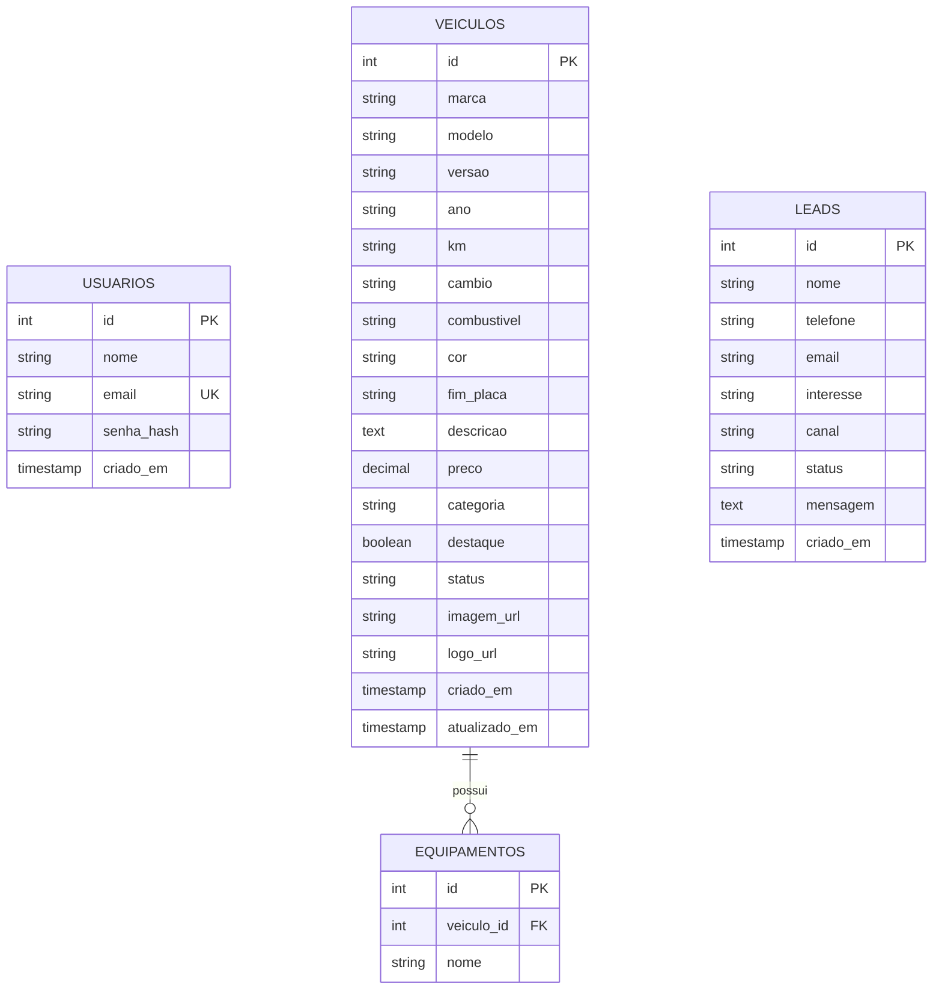

# Bassini Veículos - Estrutura do Backend e Banco de Dados

Este documento fornece as instruções de modelagem de banco de dados SQL (MySQL/PostgreSQL) e guia de configuração do backend para a plataforma **Bassini Veículos**.

---

## 1. Arquitetura do Backend Recomendada

Para conectar o Frontend HTML/CSS/JS com as tabelas criadas abaixo, recomenda-se construir uma API REST usando:
- **Node.js** com **Express** (Framework) e **Sequelize** ou **Knex** (para query builder e conexões ORM).
- **Segurança:** Autenticação por token JWT (JSON Web Tokens) e criptografia de senhas com `bcrypt`.

---

## 2. Variáveis de Ambiente (`.env`)

Crie um arquivo `.env` na raiz do projeto backend (ou copie o template do arquivo [.env.example](.env.example)) e configure os valores para o seu ambiente local:

```env
PORT=3000
NODE_ENV=development

# Conexão com o Banco de Dados
DB_HOST=localhost
DB_PORT=3306
DB_USER=seu_usuario
DB_PASS=sua_senha
DB_NAME=bassini_veiculos

# Chave JWT para login de administradores
JWT_SECRET=sua_chave_secreta_super_segura_aqui_12345
JWT_EXPIRES_IN=7d

# Configurações de redirecionamento
WHATSAPP_NUMBER=5527999999999
```

---

## 3. Modelo de Dados & Tabelas

Abaixo estão descritas as tabelas recomendadas e seus respectivos scripts DDL SQL para criação das tabelas no banco de dados.

### Diagrama de Relacionamento de Entidades (ERD)



---

### Scripts DDL SQL (Prontos para Execução)

Você pode copiar os scripts SQL abaixo e executá-los em ferramentas como MySQL Workbench, DBeaver ou pgAdmin.

```sql
-- Criação do Banco de Dados (caso não exista)
CREATE DATABASE IF NOT EXISTS bassini_veiculos;
USE bassini_veiculos;

-- 1. TABELA DE USUÁRIOS ADMINISTRATIVOS (Acesso ao Dashboard)
CREATE TABLE IF NOT EXISTS usuarios (
    id INT AUTO_INCREMENT PRIMARY KEY,
    nome VARCHAR(100) NOT NULL,
    email VARCHAR(100) UNIQUE NOT NULL,
    senha_hash VARCHAR(255) NOT NULL,
    criado_em TIMESTAMP DEFAULT CURRENT_TIMESTAMP
) ENGINE=InnoDB DEFAULT CHARSET=utf8mb4;

-- 2. TABELA DE VEÍCULOS
CREATE TABLE IF NOT EXISTS veiculos (
    id INT AUTO_INCREMENT PRIMARY KEY,
    marca VARCHAR(50) NOT NULL,
    modelo VARCHAR(100) NOT NULL,
    versao VARCHAR(150) NOT NULL,
    ano VARCHAR(15) NOT NULL, -- Ex: "2022/2022" ou "2023/2024"
    km VARCHAR(30) NOT NULL,  -- Ex: "32.000 km"
    cambio VARCHAR(30) NOT NULL, -- "Automático" ou "Manual"
    combustivel VARCHAR(30) NOT NULL, -- "Flex", "Gasolina", "Diesel" ou "Híbrido"
    cor VARCHAR(50) DEFAULT 'Não Informado',
    fim_placa VARCHAR(5) DEFAULT NULL,
    descricao TEXT,
    preco DECIMAL(10, 2) NOT NULL,
    categoria VARCHAR(30) NOT NULL, -- "suv", "sedan", "picape", "hatch"
    destaque BOOLEAN DEFAULT FALSE,
    status VARCHAR(30) DEFAULT 'disponivel', -- "disponivel", "reservado", "vendido"
    imagem_url VARCHAR(255) DEFAULT NULL,
    logo_url VARCHAR(255) DEFAULT NULL,
    criado_em TIMESTAMP DEFAULT CURRENT_TIMESTAMP,
    atualizado_em TIMESTAMP DEFAULT CURRENT_TIMESTAMP ON UPDATE CURRENT_TIMESTAMP
) ENGINE=InnoDB DEFAULT CHARSET=utf8mb4;

-- 3. TABELA DE EQUIPAMENTOS E ACESSÓRIOS DO VEÍCULO (Um veículo pode ter vários equipamentos)
CREATE TABLE IF NOT EXISTS equipamentos (
    id INT AUTO_INCREMENT PRIMARY KEY,
    veiculo_id INT NOT NULL,
    nome VARCHAR(100) NOT NULL,
    FOREIGN KEY (veiculo_id) REFERENCES veiculos(id) ON DELETE CASCADE
) ENGINE=InnoDB DEFAULT CHARSET=utf8mb4;

-- 4. TABELA DE LEADS (Captação de interesse de clientes)
CREATE TABLE IF NOT EXISTS leads (
    id INT AUTO_INCREMENT PRIMARY KEY,
    nome VARCHAR(100) NOT NULL,
    telefone VARCHAR(30) NOT NULL,
    email VARCHAR(100),
    interesse VARCHAR(150), -- Marca/modelo do carro ou texto livre
    canal VARCHAR(30) NOT NULL, -- "whatsapp", "formulario", "telefone"
    status VARCHAR(30) DEFAULT 'Novo', -- "Novo", "Contatado", "Convertido", "Aguardando"
    mensagem TEXT,
    criado_em TIMESTAMP DEFAULT CURRENT_TIMESTAMP
) ENGINE=InnoDB DEFAULT CHARSET=utf8mb4;
```

> [!NOTE]
> Se estiver utilizando **PostgreSQL**, altere o tipo `INT AUTO_INCREMENT` para `SERIAL` ou `BIGSERIAL`, remova a cláusula `ENGINE=InnoDB` e ajuste o trigger de atualização de datas do banco de dados.

---

## 4. Próximos Passos de Integração com o Frontend

1. **Substituir o LocalStorage:** Substitua as chamadas a `localStorage.getItem('bassini_vehicles')` em `js/script.js`, `js/detalhes.js` e `js/dashboard.js` por chamadas à sua nova API (`fetch` ou `axios` com método `GET` para `/api/veiculos`).
2. **Rotas da API Sugeridas:**
   - `GET /api/veiculos` - Retorna a lista de veículos ativa com filtros aplicados no backend.
   - `GET /api/veiculos/:id` - Detalhes técnicos e equipamentos de um carro específico.
   - `POST /api/leads` - Cadastra uma nova intenção de compra vinda do site.
   - `POST /api/admin/login` - Autenticação de usuários administradores no Dashboard.
   - `POST/PUT/DELETE /api/admin/veiculos` - Rotas protegidas por middleware JWT para gestão do estoque do Dashboard.